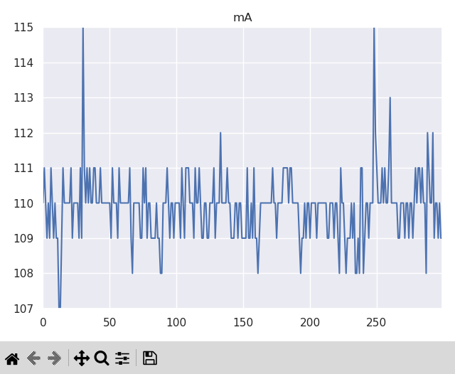

# Low Power Embedded Systems: Measuring low power modes on the ESP32C3

> This was a course project for my Master's Degree in Computer Engineering at the University of Maryland. The project was completed in May 2024.

## Abstract

I explored the power consumption of several firmware iterations for a simple embedded systems application. The application was an internet connected temperature sensor. The application would read a temperature sensor every 5 seconds and report the reading over WiFi. Each iteration of the firmware had different power consumption characteristics. I was able to reduce the power consumption of a naively written firmware by over 70%.

## Experiment Setup

Components

- [Seeduino V4.3](https://www.seeedstudio.com/Seeeduino-V4-2-p-2517.html)
- [Gravity I2C Digital Wattmeter](https://www.dfrobot.com/product-1827.html)
- [ESP32-C3-WROOM-02 Development Board](https://www.adafruit.com/product/5337)
- [Adafruit Sensirion SHT40 Temperature & Humidity Sensor Breakout](https://www.adafruit.com/product/4885)
- [3.7V 2000mAh Lithium Ion Battery](https://www.adafruit.com/product/2011)
- [PowerBoost 1000 Basic 5V DC-DC Boost Converter](https://www.adafruit.com/product/2030)
- Breadboard and assorted wires

Here is a picture of everything hooked up together

## Source Code

Contained within this repo are 4 folders, each of which contains a small software project that is a part of the overall final project.

### `powersensor/`

This folder contains the Arduino project loaded on to the Arduino-compatible board that is hooked up to the Gravity I2C power sensor. This firmware reads the current consumption from the sensor every 100ms and writes the value to its serial port.

### `sensordisplay/`

This folder contains a small python script for displaying the sensor readings. It runs on a host connected to the Arduino power sensor. It reads each current value over serial and adds it to a graph that updates live as new readings come in. It keeps a window of 300 values. A new reading comes in every 100ms, so 300 samples comprises 30 seconds of time. The Y-axis of the graph adjusts for the minimum and maximum values within the current window. The script also calculates the average, min, and max values of the 300-sample window and prints those to the terminal.

Here are a couple examples of the terminal output of this script:

And here is an example screenshot of the graph generated by the script:

Note: This script depends on the [`numpy`](https://numpy.org/) and [`live_plotter`](https://pypi.org/project/live-plotter/) python libraries. They must be installed for the script to function.

### `testserver/`

This folder contains a simple python server. It listens on a hardcoded IP address and port and logs temperature readings it receives. It also sends back a prettified representation of the temperature reading.

Here is an example of its output while receiving temperature values.

### `wifitempsensor/`

This folder contains the firmware for the WiFi temperature sensor, running on the ESP32C3. It is written in rust and primarily uses the community `esp-hal`, `esp-wifi`, and `sensor-temp-humidity-sht40` libraries for hardware support.

There are 5 iterations of the firmware. They are located in `src/bin/`.

#### `1_busy_wait.rs`

This version of the firmware is the most naive. It is the most straightforward implementation of connecting to WiFi, reading a temperature measurement, sending it to a server and waiting for 5 seconds. Notably, this implementation calls `socket.work()` while waiting for 5 seconds.

#### `2_delay.rs`

This version of the firmware replaces the call to `socket.work()` for 5 seconds with a `delay_ms` call. This call essentially loops until the 5 seconds have passed.

#### `3_light_sleep.rs`

This version of the firmware goes into light sleep, as defined by the community driver. Going into light sleep saves CPU state but turns off the WiFi peripheral. That means it needs to properly clean up the WiFi peripheral state by disconnecting before going to sleep. Then, on wake up, it needs to re-scan and re-connect to WiFi before reading the temperature and sending it.

#### `4_deep_sleep.rs`

This version of the firmware goes into deep sleep. Deep sleep turns off everything except the RTC, which is what wakes up the CPU again after 5 seconds via interrupt. On waking up from deep sleep, the MCU has to boot up again, since no CPU state is saved. It then needs to re-scan and re-connect to WiFi before reading the temperature and sending it.

#### `5_light_sleep_turn_off_sensor.rs`

This version of the firmware is a slight modification of `3_light_sleep.rs` to use a GPIO pin to turn on and off power to the sensor. Power to the sensor is only turned on long enough to read a temperature measurement.

## Results

Here are graphs showing the current consumption over a 30 second span for each version of the WiFi temperature sensor firmware.

### `busy_wait`

### `delay`

### `light_sleep`

### `deep_sleep`

### `light_sleep_turn_off_sensor`

### Summary

And here is a table summarizing the average current consumption for each version. I also calculated the estimated maximum run time for the 2000mAh battery used in the experiment.

| Firmware                      | Average current (mA) | Run time on 2Ah battery (hours) |
| :---------------------------- | :------------------: | :-----------------------------: |
| `busy_wait`                   |         110          |              18.18              |
| `delay`                       |         104          |              19.23              |
| `light_sleep`                 |          31          |              64.52              |
| `deep_sleep`                  |          49          |              40.82              |
| `light_sleep_turn_off_sensor` |          30          |              66.67              |

### Observations

The `delay` firmware only has a slight benefit over the original `busy_wait` firmware.

Light sleep does better than deep sleep because it has a smaller wake up cost. Waking up from deep sleep requires a full boot, including running the boot loader code, which takes time and outweighs the benefit of lower power consumption during the 5 seconds of sleep.

Turning off the sensor only helps a little bit and only because there is an LED on the development board for the SHT40 temperature sensor. The sensor itself uses so little current we wouldn't notice it using our power measurement setup.

### Future work

Some things to try in the future to further decrease power consumption are:

- Decreasing the CPU frequency
  - I actually tried this but the community driver I was using raised an error when I tried. I believe this is a mistake in the driver.
- Tweaking the light sleep mode configuration
  - There may be additional things we can turn off to get to a mode somewhere in-between light sleep and deep sleep that further decreases total power consumption.
